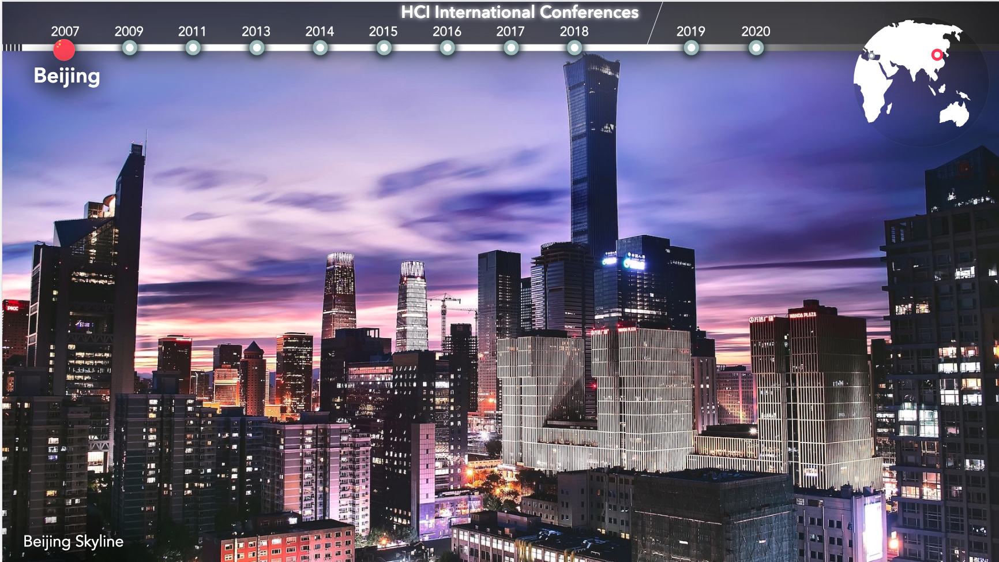
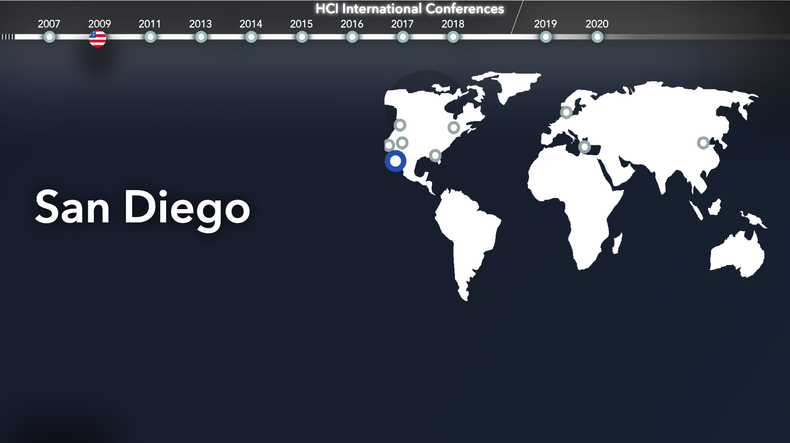
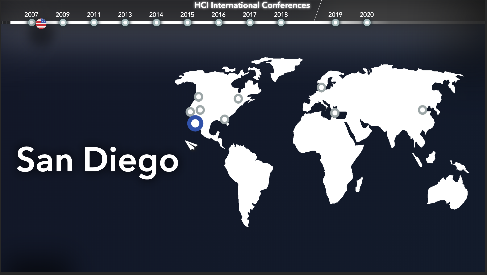
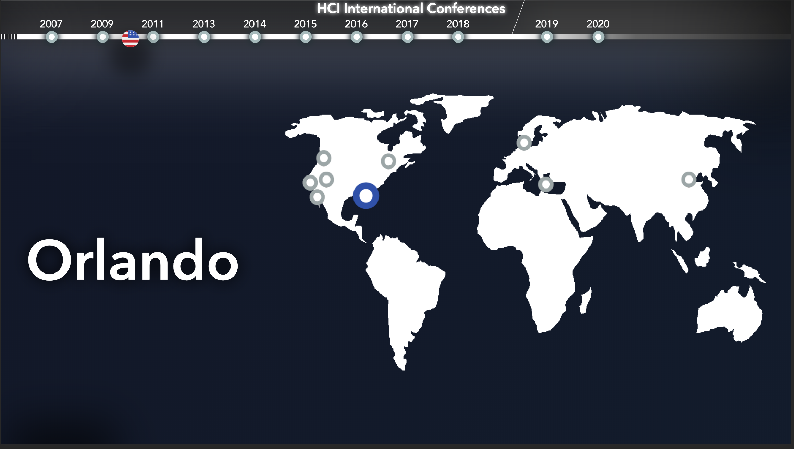
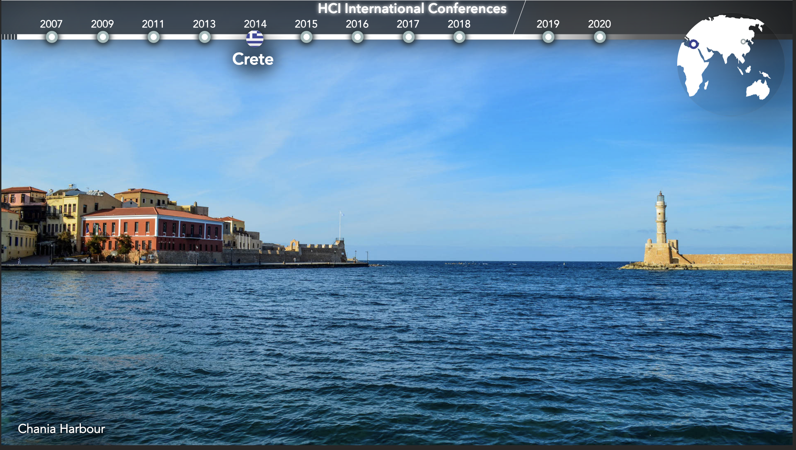
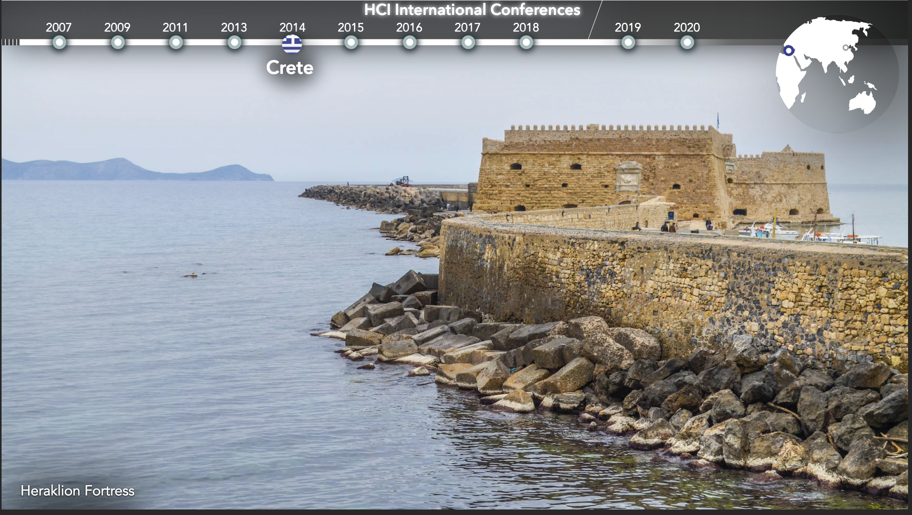
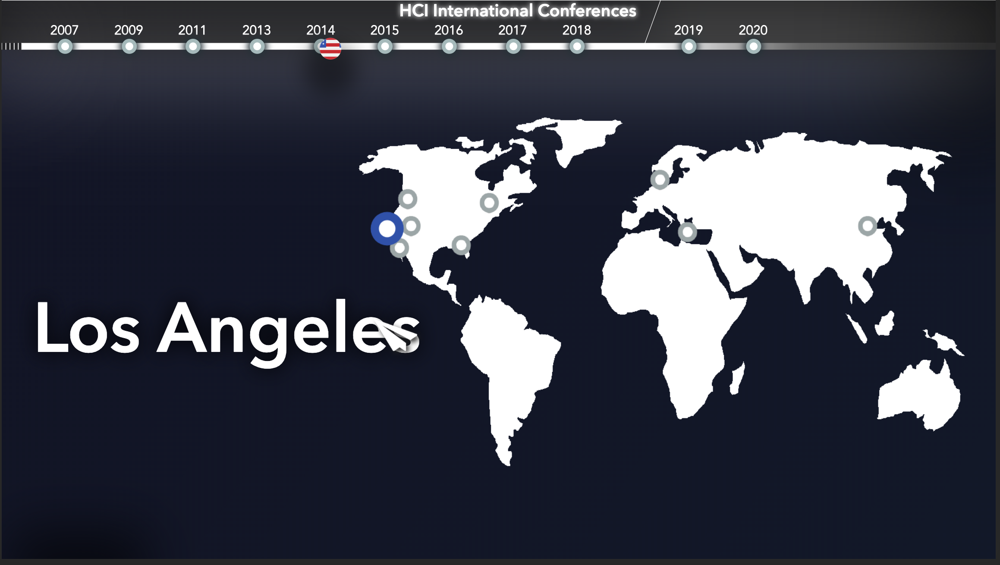

# HCI 2020 DEMO
Thesis Side Project
 Timeline of HCI conferences 2007-2020
 
 Design and development of a HCI International Conferences reminisce since 2007 through a revolving timeline in a web-app    form. The creation was projected in the 2019 HCI International Conference in Orlando, Florida for the HCI Laboratory of the  Institute of Computer Science in FORTH.
 
 
 ## Screenshots

   
 Editable:
 images.json,
 config.json

>Run with:

>"C:\Program Files (x86)\Google\Chrome\Application\chrome.exe" --disable-web-security --user-data-dir="%LOCALAPPDATA%\Google\Chrome\User Data" --kiosk Path to \index.html

